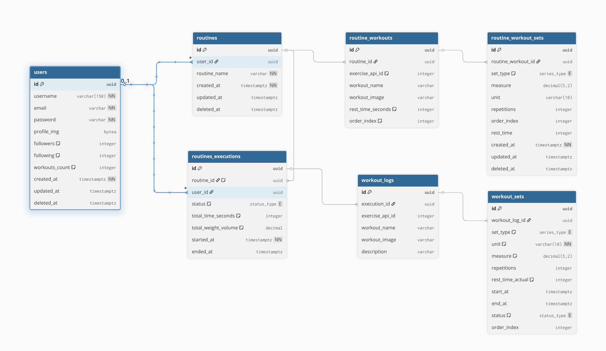

# Hevy API

API REST para gerenciamento de treinos, inspirada no aplicativo Hevy. Permite criar rotinas de exercícios, executar treinos, registrar séries e acompanhar métricas mensais de desempenho.

Link para o repositório do app: <https://github.com/KelytonSantos/HevyTwo-Front>

Link para o video de demonstração do App: <https://youtube.com/shorts/JAzCuxpWMTo>

## Sumario

1. [Tecnologias](#tecnologias)
2. [Arquitetura](#arquitetura)
3. [Estrutura do projeto](#estrutura-do-projeto)
4. [Banco de dados (DER)](#banco-de-dados)
5. [Como rodar](#como-rodar)
6. [Autenticacao](#autenticacao)
7. [Endpoints](#endpoints)
   - [Auth](#auth)
   - [Rotinas](#rotinas)
   - [Workouts / Exercicios](#workouts--exercicios)
   - [Dashboard](#dashboard)

---

## Tecnologias

| Tecnologia      | Versao / Detalhe                          |
| --------------- | ----------------------------------------- |
| Java            | 21                                        |
| Spring Boot     | 4.0.3                                     |
| Spring Security | JWT stateless (Auth0 java-jwt 4.5.0)      |
| Spring Data JPA | Hibernate + PostgreSQL dialect            |
| PostgreSQL      | Docker (postgres:latest)                  |
| Caffeine Cache  | TTL 600s, max 500 entradas                |
| Lombok          | Reducao de boilerplate                    |
| BouncyCastle    | SCrypt password hashing                   |
| ExerciseDB API  | `https://exercisedb.dev/api/v1` (externa) |
| Maven           | Build e gerenciamento de dependencias     |
| Docker Compose  | Banco de dados local                      |

---

## Arquitetura

A aplicacao segue a arquitetura em camadas padrao do Spring Boot:

```
Request
   |
   v
[Controller]  -- recebe HTTP, valida autenticacao via JWT filter
   |
   v
[Service]     -- regras de negocio, orquestra repositorios
   |
   v
[Repository]  -- Spring Data JPA, acesso ao PostgreSQL
   |
   v
[PostgreSQL]
```

Pontos de destaque:

- **Autenticacao stateless**: cada requisicao carrega um Bearer Token JWT. O filtro `JwtAuthenticationFilter` valida o token antes de qualquer controller ser acionado.
- **Cache**: chamadas para a ExerciseDB externa sao cacheadas in-memory com Caffeine para evitar rate-limit (TTL de 10 minutos).
- **Throttle por usuario**: alem do cache, o `ExerciseService` aplica um intervalo minimo de 2 segundos entre chamadas por usuario para proteger a cota da API externa.
- **Soft delete**: rotinas e sets de rotina nao sao removidos fisicamente; o campo `deleted_at` e preenchido.
- **Volume calculado no encerramento**: ao finalizar uma execucao, o volume total (kg \* reps) e calculado e persistido em `total_weight_volume`.

---

## Estrutura do projeto

```
demo/
├── docker-compose.yaml          # sobe o PostgreSQL local
├── init/
│   └── hevy.sql                 # DDL inicial (tabelas, enums)
├── seed.sh                      # popula o banco para testar o dashboard
├── pom.xml
└── src/
    └── main/
        ├── resources/
        │   └── application.properties
        └── java/com/hevy/demo/
            ├── DemoApplication.java
            ├── client/
            │   └── ExerciseDBClient.java        # HTTP client para ExerciseDB
            ├── config/
            │   ├── CacheConfig.java             # Caffeine cache
            │   ├── SecurityConfig.java          # Spring Security + CORS
            │   └── filters/
            │       └── JwtAuthenticationFilter.java
            ├── controller/
            │   ├── AuthController.java
            │   ├── DashboardController.java
            │   ├── RoutineController.java
            │   ├── WorkoutController.java
            │   └── dtos/                        # records de request/response
            ├── models/
            │   ├── User.java
            │   ├── Routine.java
            │   ├── RoutineWorkout.java
            │   ├── RoutineWorkoutSet.java
            │   ├── RoutineExecution.java
            │   ├── WorkoutLog.java
            │   ├── WorkoutSet.java
            │   └── enums/
            │       ├── Series.java              # drop_set | warm_up_set | normal_set | failure_set
            │       └── StatusType.java          # pending | canceled | completed
            ├── repository/                      # interfaces Spring Data JPA
            └── service/
                ├── AuthService.java
                ├── DashboardService.java
                ├── ExerciseService.java
                ├── JwtService.java
                ├── RoutineService.java
                ├── RoutineWorkoutService.java
                ├── WorkoutService.java
                └── exceptions/
                    ├── ResourceNotFoundException.java
                    └── ResourceIsEmptyExeception.java
```

---

## Banco de dados



### Resumo das tabelas

| Tabela                 | Descricao                                                  |
| ---------------------- | ---------------------------------------------------------- |
| `users`                | Usuarios cadastrados                                       |
| `routines`             | Rotinas criadas por um usuario                             |
| `routine_workouts`     | Exercicios que compoem uma rotina (template)               |
| `routine_workout_sets` | Series template de cada exercicio na rotina                |
| `routines_executions`  | Historico de execucao de uma rotina (uma sessao de treino) |
| `workout_logs`         | Snapshot dos exercicios gerado ao iniciar uma execucao     |
| `workout_sets`         | Series reais registradas durante a execucao                |

### Enums

- `series_type`: `drop_set`, `warm_up_set`, `normal_set`, `failure_set`
- `status_type`: `pending`, `canceled`, `completed`

---

## Como rodar

### Pre-requisitos

- Docker e Docker Compose
- Java 21
- Maven 3.x (ou use o wrapper `./mvnw`)

### 1. Subir o banco

```bash
cd demo
docker compose up -d
```

Isso sobe um PostgreSQL em `localhost:5432` com banco `hevy`, usuario `user` e senha `1234`. O schema e criado automaticamente a partir de `init/hevy.sql`.

### 2. Configurar variaveis (opcional)

As configuracoes estao em `src/main/resources/application.properties`. Os valores padrao ja funcionam com o Docker Compose acima:

```properties
spring.datasource.url=jdbc:postgresql://localhost:5432/hevy
spring.datasource.username=user
spring.datasource.password=1234
api.security.token.secret=HeavyHeavenHevy
```

### 3. Buildar e rodar a aplicacao

```bash
cd demo
./mvnw spring-boot:run
```

A API sobe em `http://localhost:8080`.

### 4. Popular dados de teste (opcional)

O script `seed.sh` cria usuarios, uma rotina, executa treinos e gera historico para testar o dashboard. Requer `curl`, `jq` e Docker rodando.

```bash
chmod +x seed.sh
./seed.sh
```

---

## Autenticacao

Todas as rotas, exceto `/auth/**`, exigem autenticacao por Bearer Token JWT.

1. Registre ou faca login para obter o token.
2. Envie o token no header de todas as requisicoes protegidas:

```
Authorization: Bearer <token>
```

O token tem validade de **30 dias**. Apos expirar, faca login novamente.

---

## Endpoints

### Auth

Base: `/auth` — rotas publicas, sem autenticacao.

---

#### POST /auth/register

Cria um novo usuario e retorna o JWT para uso imediato.

**Body**

```json
{
  "username": "lucas",
  "email": "lucas@hevy.com",
  "password": "Senha123!"
}
```

**Response `201 Created`**

```json
{
  "id": "uuid",
  "username": "lucas",
  "followers": 0,
  "following": 0,
  "workouts": 0,
  "profileImg": null,
  "createdAt": "2026-03-11T12:00:00Z",
  "jwt": "<token>"
}
```

---

#### POST /auth/login

Autentica um usuario existente.

**Body**

```json
{
  "email": "lucas@hevy.com",
  "password": "Senha123!"
}
```

**Response `200 OK`** — mesmo schema do register.

---

### Rotinas

Base: `/routines` — requer JWT.

O fluxo completo de uma sessao de treino passa por aqui:

1. Criar uma rotina
2. Adicionar exercicios (via `/workouts`)
3. Iniciar uma execucao (`/routines/init/{routineId}`)
4. Registrar series durante o treino (via `/workouts`)
5. Finalizar a execucao (`PUT /routines/{routineExecutionId}`)

---

#### GET /routines

Lista todas as rotinas do usuario autenticado com o total de exercicios em cada uma.

**Response `200 OK`**

```json
{
  "userId": "uuid",
  "totalRoutines": 2,
  "routines": [
    {
      "routineId": "uuid",
      "routineName": "Treino A",
      "totalWorkouts": 4
    }
  ]
}
```

---

#### GET /routines/{routineId}

Retorna uma rotina pelo ID, incluindo a lista de exercicios (`workouts`).

**Response `200 OK`** — objeto `Routine` com campo `workouts` populado.

**Erros**
| Status | Situacao |
|---|---|
| `404` | Rotina nao encontrada |

---

#### POST /routines

Cria uma nova rotina vazia.

**Body**

```json
{
  "routineName": "Treino A"
}
```

**Response `201 Created`** — objeto `Routine` criado.

---

#### POST /routines/init/{routineId}

Inicia uma sessao de treino baseada na rotina. Gera um `RoutineExecution` com status `PENDING` e cria automaticamente um `WorkoutLog` para cada exercicio da rotina.

**Sem body.**

**Response `201 Created`**

```json
{
  "id": "uuid",
  "status": "pending",
  "startedAt": "2026-03-11T12:00:00Z",
  "totalTimeSeconds": null,
  "totalWeightVolume": 0
}
```

**Erros**
| Status | Situacao |
|---|---|
| `404` | Rotina nao encontrada ou rotina sem exercicios |

---

#### PUT /routines/{routineExecutionId}

Finaliza uma execucao de treino. Calcula e persiste o tempo total (segundos) e o volume total (soma de `measure * reps` de todas as series completadas). Status passa para `COMPLETED`.

**Sem body.**

**Response `200 OK`** — objeto `RoutineExecution` atualizado com `endedAt`, `totalTimeSeconds`, `totalWeightVolume` e `status: "completed"`.

**Erros**
| Status | Situacao |
|---|---|
| `404` | Execucao nao encontrada |

---

#### DELETE /routines/{routineId}

Soft delete da rotina (preenche `deleted_at`).

**Response `204 No Content`**

**Erros**
| Status | Situacao |
|---|---|
| `404` | Rotina nao encontrada |

---

### Workouts / Exercicios

Base: `/workouts` — requer JWT.

Esta rota concentra tres responsabilidades:

- Busca de exercicios na ExerciseDB externa
- Montagem do template de uma rotina (quais exercicios e seus sets padrao)
- Registro de series durante uma execucao ativa

---

#### GET /workouts/api/exercise/bd

Lista exercicios da ExerciseDB com paginacao por offset. Retorna 2 exercicios por pagina. Resultados sao cacheados por 10 minutos.

**Query params**
| Param | Tipo | Padrao | Descricao |
|---|---|---|---|
| `offset` | int | `0` | Posicao inicial na lista |

**Response `200 OK`**

```json
[
  {
    "exerciseId": "VPPtusI",
    "name": "Barbell Bench Press",
    "gifUrl": "https://...",
    "targetMuscles": ["chest"],
    "instructions": ["Deite no banco...", "..."]
  }
]
```

---

#### GET /workouts/api/exercise/bd/{exerciseId}

Busca um exercicio especifico por ID na ExerciseDB. Resultado cacheado.

**Response `200 OK`** — objeto `Exercise` (mesmo schema acima).

---

#### POST /workouts/{exerciseId}/{routineId}

Adiciona um exercicio a uma rotina (template). Busca os dados do exercicio na ExerciseDB e persiste como `RoutineWorkout`.

**Sem body.**

**Response `201 Created`**

```json
{
  "id": "uuid",
  "exerciseApiId": "VPPtusI",
  "workoutName": "Barbell Bench Press",
  "workoutImage": "https://...",
  "description": "Deite no banco...",
  "restTimeSeconds": null,
  "orderIndex": null
}
```

**Erros**
| Status | Situacao |
|---|---|
| `404` | Rotina nao encontrada |

---

#### GET /workouts/my/routine/{routineId}

Lista todos os exercicios (template) de uma rotina.

**Response `200 OK`** — lista de `RoutineWorkout`.

---

#### GET /workouts/routine/workout/{routineWorkoutId}

Busca um exercicio de rotina pelo ID.

**Response `200 OK`** — objeto `RoutineWorkout`.

**Erros**
| Status | Situacao |
|---|---|
| `404` | RoutineWorkout nao encontrado |

---

#### DELETE /workouts/routine/workout/{routineWorkoutId}

Remove um exercicio de uma rotina.

**Response `204 No Content`**

**Erros**
| Status | Situacao |
|---|---|
| `404` | RoutineWorkout nao encontrado |

---

#### POST /workouts/routine/workout/{routineWorkoutId}/set

Adiciona um set template a um exercicio de rotina. Esses sets servem como referencia ao montar futuros treinos.

**Body**

```json
{
  "setType": "normal_set",
  "measure": 80.0,
  "unit": "kg",
  "repetitions": 10,
  "orderIndex": 1,
  "restTime": 90
}
```

Valores aceitos para `setType`: `normal_set`, `warm_up_set`, `drop_set`, `failure_set`.

**Response `201 Created`** — objeto `RoutineWorkoutSet`.

**Erros**
| Status | Situacao |
|---|---|
| `404` | RoutineWorkout nao encontrado |

---

#### GET /workouts/routine/workout/{routineWorkoutId}/set

Lista os sets template de um exercicio de rotina.

**Response `200 OK`** — lista de `RoutineWorkoutSet`.

**Erros**
| Status | Situacao |
|---|---|
| `404` | RoutineWorkout nao encontrado |

---

#### PATCH /workouts/routine/workout/set/{routineWorkoutSetId}

Atualiza parcialmente um set template (somente os campos enviados sao alterados).

**Body**

```json
{
  "measure": 85.0,
  "repetitions": 8,
  "restTime": 120
}
```

Todos os campos sao opcionais.

**Response `200 OK`** — objeto `RoutineWorkoutSet` atualizado.

**Erros**
| Status | Situacao |
|---|---|
| `404` | RoutineWorkoutSet nao encontrado |

---

#### DELETE /workouts/routine/workout/set/{routineWorkoutSetId}

Soft delete de um set template (preenche `deleted_at`).

**Response `204 No Content`**

**Erros**
| Status | Situacao |
|---|---|
| `404` | RoutineWorkoutSet nao encontrado |

---

#### GET /workouts/my/{routineExecutionId}

Lista os `WorkoutLog` de uma execucao ativa (status `PENDING`). Cada log representa um exercicio que deve ser executado nessa sessao.

**Response `200 OK`** — lista de `WorkoutLog`.

**Erros**
| Status | Situacao |
|---|---|
| `404` | Execucao nao encontrada |
| `400` | Execucao ja foi finalizada ou cancelada |

---

#### POST /workouts/init/{workoutLogId}

Registra uma serie para um exercicio durante a execucao ativa. Cria um `WorkoutSet` com status `PENDING`.

**Body**

```json
{
  "unit": "kg",
  "rep": 10,
  "orderIndex": 1,
  "measure": 80.0,
  "type": "normal_set",
  "restTime": 90
}
```

**Response `201 Created`** — objeto `WorkoutSet`.

**Erros**
| Status | Situacao |
|---|---|
| `404` | WorkoutLog nao encontrado |
| `400` | Execucao pai ja finalizada ou cancelada |

---

#### POST /workouts/set/{workoutSetId}/finish

Finaliza uma serie. Define `endAt` e muda status para `COMPLETED`.

**Sem body.**

**Response `200 OK`** — objeto `WorkoutSet` atualizado.

**Erros**
| Status | Situacao |
|---|---|
| `404` | WorkoutSet nao encontrado |
| `400` | Execucao pai ja encerrada, ou set ja finalizado/cancelado |

---

#### POST /workouts/set/{workoutSetId}/cancel

Cancela uma serie. Define `endAt` e muda status para `CANCELED`.

**Sem body.**

**Response `200 OK`** — objeto `WorkoutSet` atualizado.

**Erros**
| Status | Situacao |
|---|---|
| `404` | WorkoutSet nao encontrado |
| `400` | Execucao pai ja encerrada, ou set ja finalizado/cancelado |

---

#### GET /workouts/set/log/{workoutLogId}/pending

Lista somente as series com status `PENDING` de um workout log.

**Response `200 OK`** — lista de `WorkoutSet`.

**Erros**
| Status | Situacao |
|---|---|
| `404` | WorkoutLog nao encontrado |
| `400` | Execucao pai ja encerrada |

---

#### GET /workouts/set/log/{workoutLogId}

Lista todas as series de um workout log (qualquer status).

**Response `200 OK`** — lista de `WorkoutSet`.

**Erros**
| Status | Situacao |
|---|---|
| `404` | WorkoutLog nao encontrado |

---

### Dashboard

Base: `/dashboard` — requer JWT.

---

#### GET /dashboard

Retorna as metricas mensais do usuario autenticado, comparando o mes atual com o anterior.

**Response `200 OK`**

```json
{
  "workouts": 12,
  "surplusBalance": 3,
  "isSurplus": true,
  "totalDuration": 86400,
  "volume": 24000,
  "totalSets": 108,
  "topUsers": 75,
  "avgHours": 0.96
}
```

| Campo            | Descricao                                                            |
| ---------------- | -------------------------------------------------------------------- |
| `workouts`       | Total de treinos no mes atual                                        |
| `surplusBalance` | Diferenca absoluta entre treinos do mes atual e mes anterior         |
| `isSurplus`      | `true` se treinou mais que no mes passado                            |
| `totalDuration`  | Soma de `total_time_seconds` de todas as execucoes do mes (segundos) |
| `volume`         | Volume total (kg) do mes atual                                       |
| `totalSets`      | Total de series completadas no mes                                   |
| `topUsers`       | Percentil de volume do usuario em relacao aos demais (0-100)         |
| `avgHours`       | Media de horas de treino por dia no mes atual                        |

---

#### GET /dashboard/graph

Retorna os dados de horas de treino por dia para plotar um grafico de linha do mes atual. O array comeca no dia 1 e vai ate o dia atual.

**Response `200 OK`**

```json
{
  "data": [
    { "days": 1, "hours": 1.5 },
    { "days": 2, "hours": 0.0 },
    { "days": 3, "hours": 0.75 },
    { "days": 11, "hours": 2.0 }
  ]
}
```

| Campo   | Descricao                                                 |
| ------- | --------------------------------------------------------- |
| `days`  | Dia do mes (1 ate o dia atual)                            |
| `hours` | Total de horas de treino naquele dia (0.0 se nao treinou) |

Use `days` como eixo X e `hours` como eixo Y. O array cresce conforme o mes passa.
